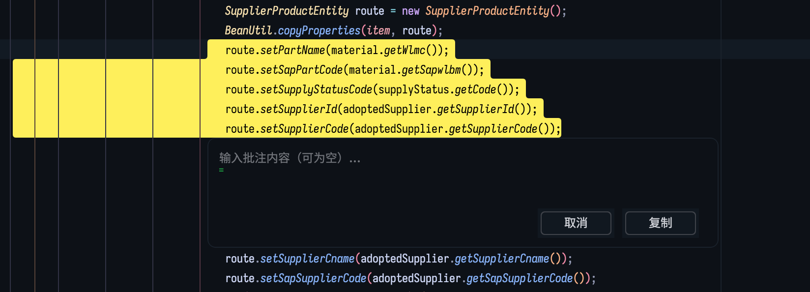
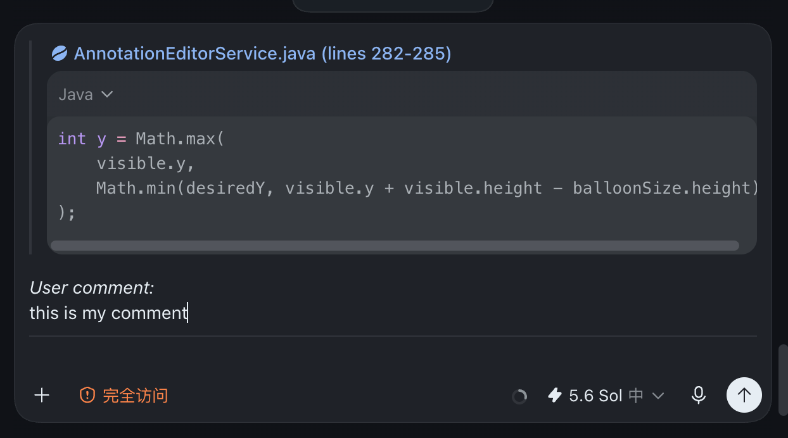

# Selection Annotation

**English** | [简体中文](README.zh-CN.md)

[](https://github.com/zuozh11/idea-annotation/actions/workflows/build.yml)
[](https://plugins.jetbrains.com/plugin/33955-selection-annotation)
[](https://plugins.jetbrains.com/plugin/33955-selection-annotation)


Selection Annotation is an IntelliJ IDEA plugin that turns one or more editor selections into a compact Markdown annotation ready to paste into Codex or another conversation. It automatically includes local source links, accurate line ranges, de-indented selected text, and a shared comment.





## Features

- Open **Annotate…** from the native IDEA floating code toolbar or the editor context menu.
- Annotate multiple carets at once with one shared multiline comment.
- Paste local files, directories, or clipboard images into the comment as clickable resource links.
- Copy selected context from the native floating code toolbar or directly with **Option+C** on macOS and **Alt+C** on Windows/Linux.
- Copy whole-line selections as compact source links without repeating the selected code.
- Copy Markdown links for the current file or Project View files and directories, including multi-selection.
- Use **Copy Path** from the editor or Project View context menu.
- Choose whether Enter or Shift+Enter confirms the annotation; the other key inserts a new line.
- Use the current editor buffer, including unsaved files and Scratch files with a real local path.
- Calculate 1-based single-line or multiline ranges without counting an unselected next line after a trailing newline.
- Remove leading blank lines and common indentation while preserving relative indentation.
- Keep the original selection after a successful copy and preserve the entered comment when clipboard writing fails.
- Follow the IDE language with English and Simplified Chinese user-interface text.

## Usage

1. Select one or more text ranges in a local text file.
2. Click **Annotate…** in the floating code toolbar, or choose **Annotate…** from the editor context menu.
3. Enter a comment and optionally paste local resources or an image from the clipboard.
4. Click **Confirm**, or use the configured confirmation key.
5. Paste the clipboard content into the target conversation.

Use **Copy Selection** in the floating code toolbar or **Option+C**/**Alt+C** to copy selected context without opening the input. With no editor selection, the shortcut copies the current file link; in Project View, it copies links for the selected files or directories.

Example output:

````markdown
> [Example.java (lines 42-45)](/project/src/Example.java)

_User comment:_

Please check the boundary conditions here.

[Image 1](/tmp/selection-annotation-clipboard-example.png)

---

````

## Compatibility

- IntelliJ IDEA 2026.2 or later, with minimum platform build `262`.
- Java/JBR 25.
- Regular local text files and Scratch files with a real local path.
- Diff editors and temporary files without a stable local path are not supported.

## Installation

After building locally, open **Settings → Plugins → ⚙ → Install Plugin from Disk…** in IDEA and select the ZIP under `build/distributions/`.

Marketplace page: [Selection Annotation](https://plugins.jetbrains.com/plugin/33955-selection-annotation).

## Development

This is a single-module Java Gradle project that uses the committed Gradle Wrapper:

```bash
./gradlew buildPlugin   # Build the installable ZIP
./gradlew runIde        # Launch an IDEA sandbox with the plugin
./gradlew test          # Run tests
./gradlew verifyPlugin  # Run IntelliJ Plugin Verifier
```

If the default system Java is not version 25, use the JBR bundled with IDEA:

```bash
export JAVA_HOME="/Applications/IntelliJ IDEA.app/Contents/jbr/Contents/Home"
export PATH="$JAVA_HOME/bin:$PATH"
./gradlew buildPlugin
```

The installable ZIP is written to `build/distributions/`; build output is not committed.

## Release Maintenance

- The current version is defined by `version` in `build.gradle.kts`.
- Marketplace and GitHub Release notes for the current version are maintained in `RELEASE_NOTES.md`; complete history is maintained in `CHANGELOG.md`.
- Initial Marketplace setup, signing certificates, GitHub Secrets, tag-triggered releases, failure handling, and release evidence are documented in the [JetBrains Marketplace publishing guide](docs/publishing.md).
- The repository copy of the Developer EULA is available in [EULA.md](EULA.md), and Marketplace uses the [public version](https://gist.github.com/zuozh11/ea84559dc08fa8efeba10d0c5a1152e1).

## Data Boundary

The plugin only reads current selections, focused local file paths, and resources explicitly pasted into the annotation input. Clipboard images are saved as uniquely named PNG files in the system temporary directory so the generated Markdown can reference them. The plugin does not send network requests, collect telemetry, or persist annotation history. Absolute paths are included in clipboard content, so verify the destination and content before pasting into an external service.
