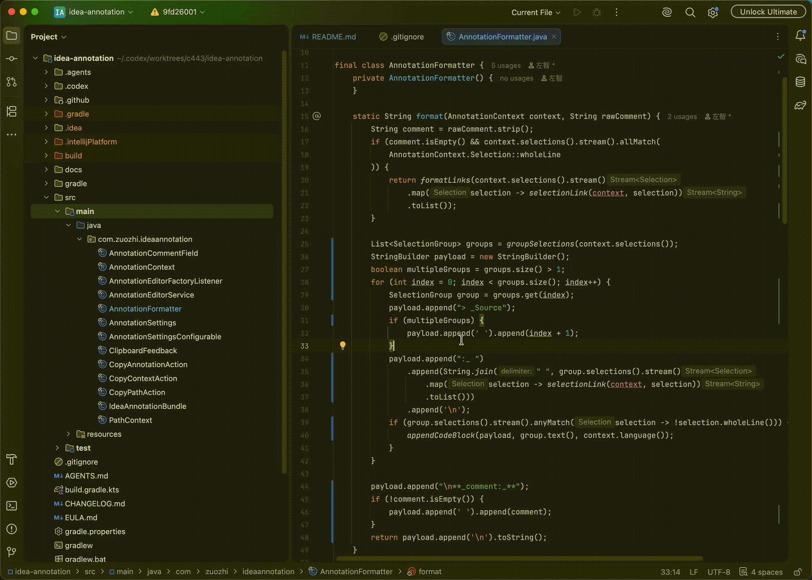

# Selection Annotation

[English](README.md) | **简体中文**

[](https://github.com/zuozh11/idea-annotation/actions/workflows/build.yml)
[](https://plugins.jetbrains.com/plugin/33955-selection-annotation)
[](https://plugins.jetbrains.com/plugin/33955-selection-annotation)


Selection Annotation 是 IntelliJ IDEA 插件，用于把一个或多个编辑器选区整理成可直接粘贴到 Codex 等对话中的紧凑 Markdown 批注：自动携带本地来源链接、准确行号、去除整体缩进的所选文本和共享评论。



## 功能

- 从 IDEA 原生浮动代码工具栏或编辑器右键菜单打开“批注…”。
- 支持一次批注多个光标选区，并填写一条共享多行评论。
- 批注编辑器跟随主题、按内容自动增高，失去焦点时仍保留，并为全部引用选区显示边框。
- 可把本地文件、目录或剪贴板图片粘贴到评论中，并显示为可点击的资源链接。
- 从原生浮动代码工具栏复制选区，或在 macOS 使用 **Option+C**、Windows/Linux 使用 **Alt+C** 直接复制选中上下文。
- 完整行选区仅复制紧凑的来源链接，不重复附带选中代码。
- 复制当前文件或 Project View 中单选、多选文件和目录的 Markdown 链接。
- 从编辑器或 Project View 右键菜单使用 **复制路径**。
- 可设置由 Enter 或 Shift+Enter 确认批注，另一个按键用于换行。
- 使用当前编辑器缓冲区内容，支持未保存文件和具有真实本地路径的 Scratch 文件。
- 自动计算 1-based 单行或多行范围，选区末尾换行不会误计下一行。
- 删除选区首部空白行和公共缩进，同时保留相对缩进。
- 复制成功后保留原选区；复制失败时保留已输入评论以便重试。
- 用户界面提供英文和简体中文资源。

## 使用方式

1. 在本地文本文件中选中一段或多段文字。
2. 点击浮动代码工具栏中的 **批注…**，或从编辑器右键菜单选择 **批注…**。
3. 按需输入评论，并可粘贴本地资源或剪贴板图片。
4. 点击 **确认**，或使用当前设置的确认键。
5. 将剪贴板内容粘贴到目标对话。

使用浮动代码工具栏中的 **复制选区** 或 **Option+C**/**Alt+C** 可跳过输入框直接复制选中上下文。编辑器无选区时，快捷键复制当前文件链接；Project View 中则复制所选文件或目录链接。

示例输出：

````markdown
> _Source:_ [Example.java (lines 42-45)](/project/src/Example.java)

**_comment:_** 请检查这里的边界条件。

[Image 1](/tmp/selection-annotation-clipboard-example.png)
````

## 兼容范围

- IntelliJ IDEA 2026.2 及以上，最低平台构建为 `262`。
- Java/JBR 25。
- 普通本地文本文件和具有真实本地路径的 Scratch 文件。
- 不支持 Diff 编辑器和无稳定本地路径的临时文件。

## 安装

本地构建后，在 IDEA 中打开 **Settings → Plugins → ⚙ → Install Plugin from Disk…**，选择 `build/distributions/` 下的 ZIP。

Marketplace 页面：[Selection Annotation](https://plugins.jetbrains.com/plugin/33955-selection-annotation)。

## 开发

项目为单模块 Java Gradle 工程，使用仓库内的 Gradle Wrapper：

```bash
./gradlew buildPlugin   # 生成可安装 ZIP
./gradlew runIde        # 启动带插件的 IDEA 沙箱
./gradlew test          # 运行测试
./gradlew verifyPlugin  # 运行 IntelliJ Plugin Verifier
```

如果系统默认 Java 不是 25，可使用 IDEA 自带 JBR：

```bash
export JAVA_HOME="/Applications/IntelliJ IDEA.app/Contents/jbr/Contents/Home"
export PATH="$JAVA_HOME/bin:$PATH"
./gradlew buildPlugin
```

可安装 ZIP 输出到 `build/distributions/`，构建产物不进入 Git。

## 发布维护

- 当前版本由 `build.gradle.kts` 的 `version` 定义。
- 当前版本 Marketplace/GitHub Release 说明维护在 `RELEASE_NOTES.md`，完整历史维护在 `CHANGELOG.md`。
- 首次建档、签名证书、GitHub Secrets、标签触发、失败处理和发布证据见 [JetBrains Marketplace 发布指南](docs/publishing.md)。
- Developer EULA 的仓库副本见 [EULA.md](EULA.md)，Marketplace 使用[公开版本](https://gist.github.com/zuozh11/ea84559dc08fa8efeba10d0c5a1152e1)。

## 数据边界

插件只读取当前选区、焦点上下文中的本地文件路径，以及用户明确粘贴到批注输入框的资源。剪贴板图片会以唯一名称写入系统临时目录，供生成的 Markdown 引用。插件不发送网络请求，不收集遥测，也不持久化批注历史。绝对路径会出现在剪贴板内容中，粘贴到外部服务前请确认目标和内容。
